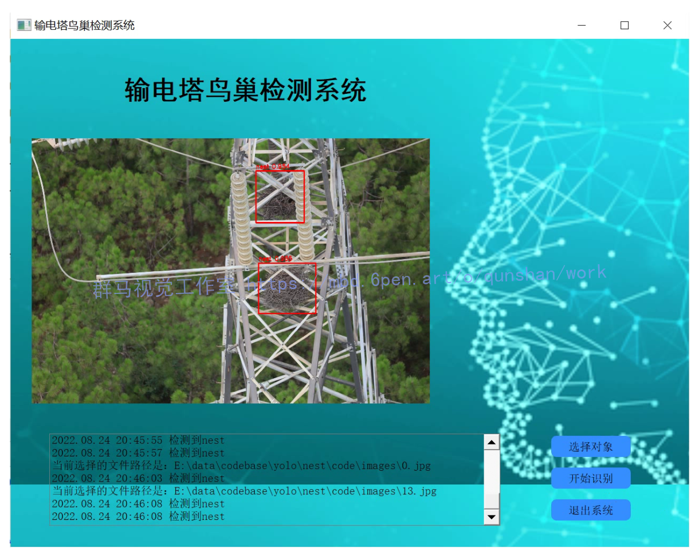
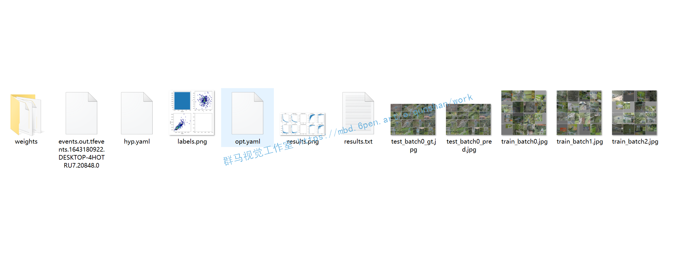
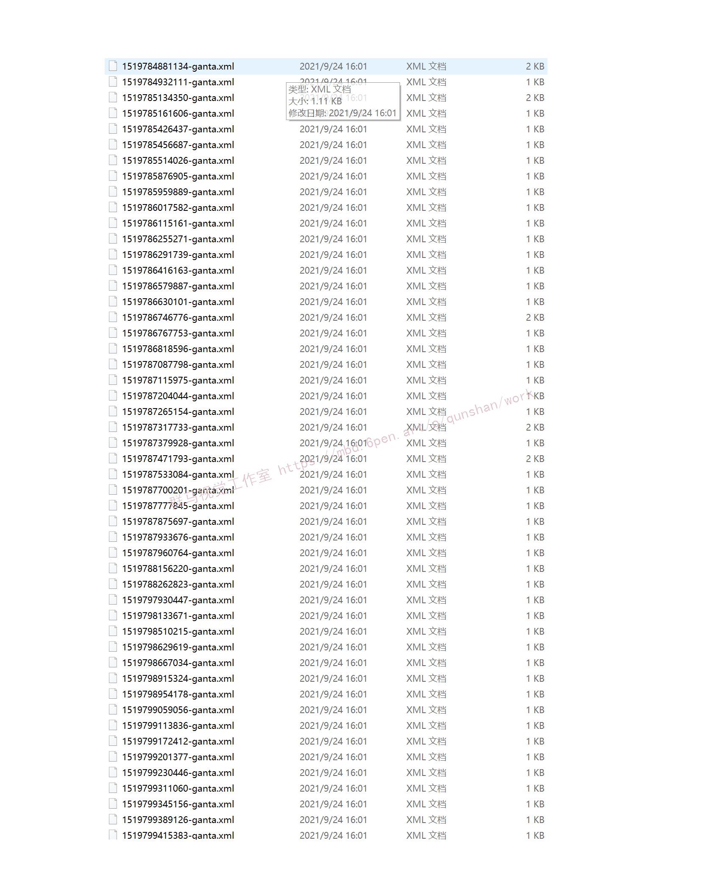
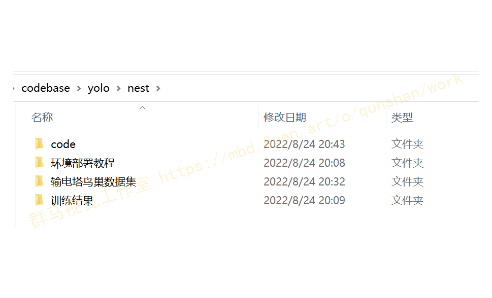


# 1.输电塔绝缘子上鸟巢检测Python＆YOLOv5

## （1）图片检测：

## （2）视频检测：

[[项目分享]输电塔绝缘子上鸟巢检测Python＆YOLOv5源码*哔哩哔哩*bilibili](https://www.bilibili.com/video/BV1mY4y1F7Cr/?vd_source=bc9aec86d164b67a7004b996143742dc)

## （3）完整视频演示：

[[项目分享]输电塔绝缘子上鸟巢检测Python＆YOLOv5源码*哔哩哔哩*bilibili](https://www.bilibili.com/video/BV1mY4y1F7Cr/?vd_source=bc9aec86d164b67a7004b996143742dc)

## （4）部分教程展示：

## （5）训练结果展示：

# 2.包含鸟巢目标检测图像数据集

[数据集使用博客提供](https://afdian.net/item?plan_id=65744d3e5d9e11ed8e8152540025c377)

# 3.所需依赖库（安装方法教程有视频教程）

[参考博客](https://mbd.pub/o/bread/Yp6Vm5ps)
# pip install -r requirements.txt

# Base ----------------------------------------

matplotlib>=3.2.2

numpy>=1.18.5

opencv-python>=4.1.2

Pillow>=7.1.2

PyYAML>=5.3.1

requests>=2.23.0

scipy>=1.4.1

PyQt5

tqdm>=4.41.0

# Logging -------------------------------------

tensorboard>=2.4.1

# wandb

# Plotting ------------------------------------

pandas>=1.1.4

seaborn>=0.11.0

# 3.背景
输电线路上的鸟巢检测是智能电网中智能巡检的重要研究内容,鸟类在输电线路杆塔上的筑巢会对输电线路等设备造成不良影响,甚至危害电网的安全运行。然而传统的人工巡检输电线路的方式耗时耗力且存在危险,给电力工作者带来很大的困扰。
# 4.国内外研究现状
高压输电线路上鸟巢的检测属于图像分类以及目标检测【2】【3】领域的问题，是计算机视觉和图像处理领域的主要研究方向。并且在最近数十年时间被广泛应用于不同的科研领域，例如人脸检测[4】，智能车辆检测[51。最近几年提出的神经网络等方法，使得目标的识别和定位技术更加高效、准确。针对鸟害的预防问题逐渐变成了一个世界性的课题嘲，变电站和输电系统为此做出巨大的努力，付出巨多的人力、物力和财力忉。鸟类不仅给电力系统带去很多麻烦，也给捕鱼业【引、农业(果园【9】等)等带来一定的困扰。不仅如此，大量文献以及相关资料【lo】【ll】显示鸟类的某些行为不仅造成电力系统的严重损失，其本身伤亡数量也是很严重的。2011年【12】，印度某地区，624个混凝土高压柱下发现160个鸟类的尸体。文献【13】表明，相比于杆塔，在铁塔中鸟害故障要占90％之多。因为铁塔地势高，框架结构明显，鸟类更容易在上面筑巢。为了保护电力系统也是为了保护鸟类本身，根据文献[14】，美国在输电线路和变电站电力设备对于乌害防治的方法和措施，采用多达800种防范鸟害的措施，具有很多值得国内学习和借鉴的地方。
算法参考[博客](https://s.xiaocichang.com/s/c84b6d)

# 5.相关技术介绍
不同的场景或不同的拍摄机器等都会形成不一样的图像，如分辨率过高、过低、图像大小不一、光照明暗不均等。这些特性将会严重影响着文本定位、目标识别、图像分割或字符识别等各个过程。在将原始条件下的文本图像输入到各个应用模块之前，对图像进行不同程度的预处理，不仅会减少计算量，缓解计算内存压力，对定位和识别正确率的提高也会有很大的帮助。
对于现实生活中的图像，视频或者是相机拍摄的绝大多数都是彩色图像，使用R、G、B三个分量来表示一个像素的颜色，并分别使用矩阵来描述每一种颜色通道，每个通道的取值范围为[O，255]。灰度图像中的灰度值，又称做强度值、亮度值，只需要使用一个字节来存放0-255之间的灰度值
二值化操作就是利用灰度化之后的图进行的又一次像素处理。一般要选用相应的阈值，使得大于阈值的和小于阈值的分别统一化为255(或者1)和0。有两种方法确定阂值：全局二值化，局部自适应二值化。全局二值化就是设定一个全局的阈值T，将整体的图像分为大于T和小于T的两部分。因此全局二值化有一个明显的缺陷：很难体现图像的细节。而局部自适应二值化便可以很好的解决这一问题。该方法在全局二值化的基础之上，将整个图像利用滑动窗口进行处理。每一个滑动窗口的二值化阂值的选择是根据参数方程来确定，而该参数方程通常由该窗口像素平均值，像素之间的差平方，像素之间的均方根值等特征来限定阈
值的动态选取。

# 6.参考文献
[10]Frazier S D．Birds，substations，and transmission[C]／／Power Engineering Society Winter
Meeting．IEEE，200 1：355—358．
[2]Sande K E A V D，Uijlings J R R Gevers T，et a1．Segmentation as selective search for object
recognition[C]／／IEEE International Conference on Computer Vision，ICCV 20 1 1，Barcelona,
Spain,November．DBLP,201 1：1 879—1 886．
[3]Hosang J，Benenson R Dollar只et a1．What makes for effective detection proposals[J]．IEEE
Transactions on PatternAnalysis&Machine Intelligence，2016，38(4)：814．
[4]Viola只Jones M J．Robust Real—Time Face Detection[J]．Intemational Journal of Computer
Vision，2004，57(2)：137—154．

---
#### 如果您需要更详细的【源码和环境部署教程】，除了通过【系统整合】小节的链接获取之外，还可以通过邮箱以下途径获取:
#### 1.请先在GitHub上为该项目点赞（Star），编辑一封邮件，附上点赞的截图、项目的中文描述概述（About）以及您的用途需求，发送到我们的邮箱
#### sharecode@yeah.net
#### 2.我们收到邮件后会定期根据邮件的接收顺序将【完整源码和环境部署教程】发送到您的邮箱。
#### 【免责声明】本文来源于用户投稿，如果侵犯任何第三方的合法权益，可通过邮箱联系删除。